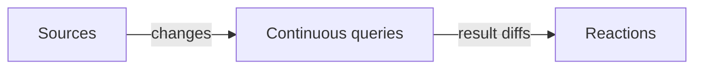

`Drasi` embeds the [Drasi](https://drasi.io) continuous-query engine inside
your .NET process. To use it well, it helps to understand three building blocks:
**sources**, **continuous queries**, and **reactions**, and the change-driven
model that ties them together.

## The change-driven model

Traditional applications pull. You run a query, get an answer, and that answer
is stale the moment the data changes. To stay current you poll, diff, and
re-run.

Drasi flips this around. You declare a **continuous query** once, and the engine
keeps its result set up to date as the underlying data changes. Rather than
re-running the query, Drasi tells you exactly what changed: which rows were
**added**, **updated**, or **removed**.

Everything runs **in-process**. The engine, the queries, and your C# sources
and reactions all live in the same process. The engine itself does not need an
external server, message broker, or database.

## Sources

A **source** feeds changes into the engine as a stream of graph elements:
**nodes** (with labels and properties) and **relations** (edges between nodes).
Drasi models incoming data as a property graph so a single query can span
multiple sources.

`Drasi` gives you two kinds of source:

- **In-process.** `AddSourceAsync(id)` registers a source you drive with
  `PushChangeAsync`. Use this when the data already lives in your application.
- **Plugin.** `AddSourceAsync(kind, id, config)` loads a native source plugin
  (`source/postgres`, `source/mock`, and others) after you
  [install plugins](../guides/plugins/).

A `SourceChange` is one graph mutation:

| Field | Meaning |
| --- | --- |
| `Op` | `Insert`, `Update`, or `Delete` |
| `Id` | Graph key for the element |
| `Labels` | Node or relation labels |
| `Properties` | Property map (`JsonObject`). Include `id` here if a query selects it. |
| `StartId` and `EndId` | Required together when the element is a relation |

## Continuous queries

A **continuous query** is a Cypher or GQL statement that the engine keeps
current. You add one with `AddQueryAsync(id, query, sources)`.

The v1 query API is a **string**. There is no LINQ or `IQueryable` provider.
Continuous-query semantics (live diffs, not a one-shot enumeration) do not map
onto LINQ, and the Python and Node libraries also take query strings.

After `AddQueryAsync`, call `WaitForQueryAsync` before you push data or read
results. Provisioning returns first. The query finishes starting in the
background.

Read the current result set with `GetQueryResultsAsync`. Subscribe to diffs
with a reaction or with `QueryResultsAsync` (`IAsyncEnumerable<QueryResultEvent>`).

Set `QueryOptions.Language` to `QueryLanguage.Gql` when the string is GQL.
The default is Cypher.

## Reactions

A **reaction** runs whenever a query's result set changes. Each event is a
`QueryResultEvent` with a list of `QueryDiff` rows (`Add`, `Update`, `Delete`).

Two kinds:

- **In-process.** `AddReactionAsync(id, queryIds, callback)` invokes a C#
  `Action<QueryResultEvent>`.
- **Plugin.** `AddReactionAsync(kind, id, queryIds, config)` loads a native
  reaction plugin after you install plugins.

For callbacks that must not lose work across restarts, use
`AddDurableReactionAsync`. That API requires a redb
[`StateStore`](../api/#engineoptions) on the engine.

## The `Engine` class

`Engine` is the main type. Create it with `Engine.CreateAsync`, start it with
`StartAsync`, and dispose it with `await using`. Call `ShutdownAsync` when you
need to release native stores, including the RocksDB lock, before dispose.

Hosted applications can skip the manual lifecycle. Call `AddDrasi` and the
generic host starts the engine, applies the topology, and shuts it down. See
[Use the generic host](../guides/hosting/).

## Logging

Pass `EngineOptions.LoggerFactory` (or `Logger`) to send native `tracing` and
`log` events through `Microsoft.Extensions.Logging`. Categories are `Drasi` and
`Drasi.{tracing-target}` (Rust `::` becomes `.`). Without a factory, native
logs go to stderr and honour `RUST_LOG` (default `warn`). `AddDrasi` picks up
the host `ILoggerFactory`.
